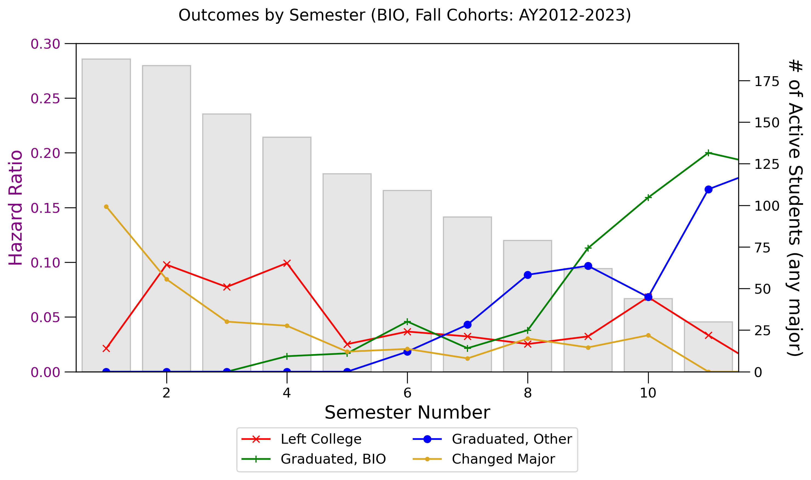
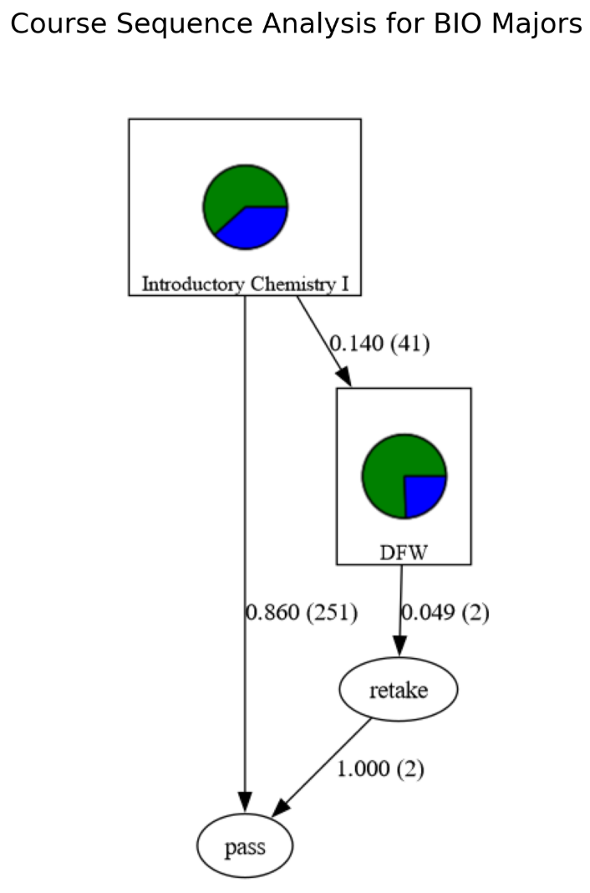

Workflows
=========

The ``student_success`` package provides end-to-end analytics workflows for student progression, retention, and course performance. Each workflow combines utilities, metrics, and visualization tools. Below are key capabilities and example outputs.

Data Cleaning
-------------
Cleans and normalizes raw institutional data into analyzable structures. Common tasks include standardizing term codes,
flagging transfer students and associate coursework, filtering invalid records and ranges, and producing tidy tables for
downstream analysis.

See :doc:`examples/data_cleaning` for a walkthrough.

Hazard Analysis
---------------
Models student retention and attrition across semesters. Capabilities include assigning retention outcomes (retained,
leaver, graduated), calculating cumulative probabilities and hazard ratios, and visualizing retention curves over time

See :doc:`examples/example_hazard_analysis` for a walkthrough.

Outputs from these resources provide time-based insight into student behavior since matriculation. A visualization of a
hazard analysis is shown below for a hypothetical cohort of biology majors.

Interactive visualizations of flows between majors and patterns in which courses are taken are also available. Below is an
interactive heat map that illustrating when members of a student cohort take various courses during their degree program.

.. only:: html

    .. raw:: html

        <iframe src = "../_static/figures/example_course_heatmap.html"
            width = "100%" height="500" style = "border:none;"></iframe>

Markov Diagrams
---------------
Visualizes flows of students between majors or statuses. Features include transition probabilities between states,
Sankey/Markov diagrams with node styling, and options for demographic overlays (e.g., sex, PELL status).

See :doc:`examples/example_markov_diagrams` for a walkthrough.

Outputs from these resources can produce single or multiple course flows with customizable pie charts. An example of a
single-course Markov diagram is shown below.

